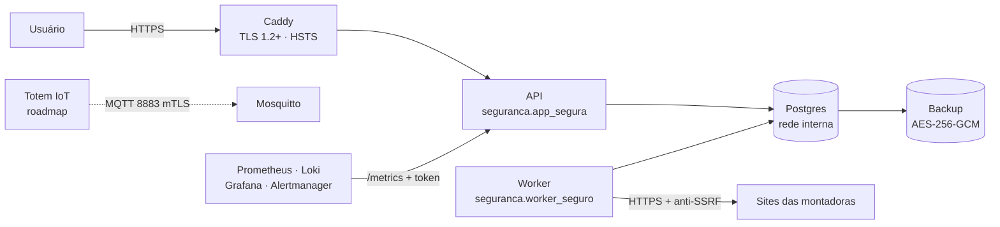
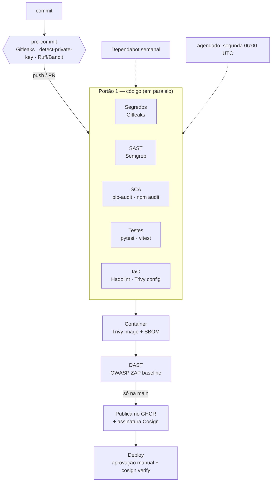
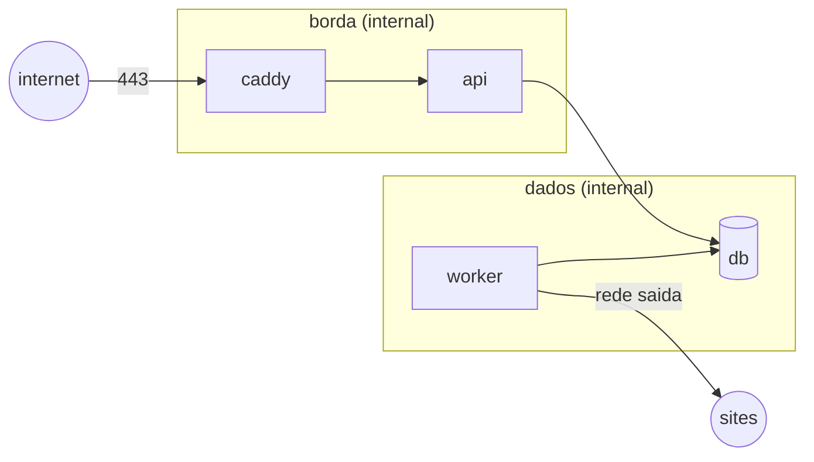
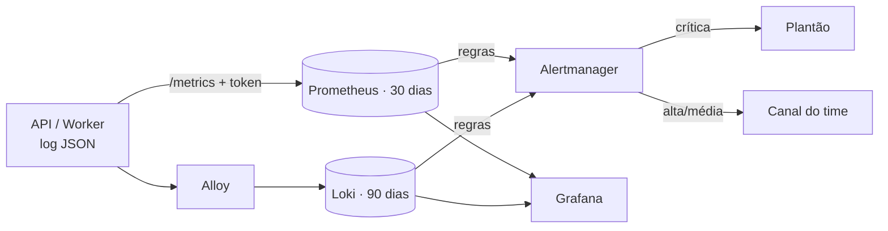

# Sprint 3 — Cybersecurity: DevSecOps no SpecRadar (Ford Challenge)

**FIAP · 3ESPX · 2026 — Desafio 01 Ford**

| Integrante | RM |
|---|---|
| Arnaldo Filho | 555780 |
| Carlos Eduardo | 99849 |
| Vinicius Gardim | 556013 |
| Leonardo Correia | 550413 |
| Fabricio Carlos | 555017 |

> Documento único da Sprint, separado pelas quatro atividades. Tudo o que é citado existe no
> repositório e foi executado. As saídas reais estão em [`evidencias/`](../evidencias/), com
> um print de cada uma em [`evidencias/prints/`](../evidencias/prints/) (índice no §6).

## 0. Contexto

O **SpecRadar** coleta fichas técnicas nos sites das montadoras, extrai os valores com regex e
LLM e só publica um valor quando encontra o **trecho literal** dele na fonte salva. Sobre as
fichas funcionam o Radar de mudanças, a Matriz de paridade, o Showroom e o Simulador.

O código da solução está em [`fordChallenge/`](../fordChallenge/) e **não foi alterado nesta
Sprint**. A segurança fica na raiz e entra **por composição**:
- o pacote [`seguranca/`](../seguranca/) importa a API e o pipeline da solução e aplica os
  controles por cima, com testes próprios em [`tests/`](../tests/);
- [`.github/`](../.github/), [`infra/`](../infra/) e
  [`observabilidade/`](../observabilidade/) definem como a solução é construída, implantada
  e monitorada.



| Domínio | Estado real na solução | Tratamento nesta Sprint |
|---|---|---|
| API | FastAPI com JWT, RBAC, rate limit e CSP | endurecimento + testes (§2.2) |
| Mobile | web app **responsivo**; app Expo previsto | OWASP Mobile Top 10 (§4.4) |
| IoT | **não há dispositivo**; totem no roadmap | MQTT/TLS com mTLS e ACL, testado, **não em produção** (§2.4) |
| Dados | Postgres/SQLite; e-mail e nome de funcionários | criptografia em repouso, backup cifrado, LGPD |
| ML | extração com LLM + eval contra gabarito | métricas de qualidade com alertas (§3.2) |
| Arquitetura | API + worker + banco | rede segmentada, imagem endurecida (§2.5) |

---

## 1. Atividade 1 — Pipeline DevSecOps integrado (3,0)

**Arquivo:** [`.github/workflows/devsecops.yml`](../.github/workflows/devsecops.yml) ·
[`dependabot.yml`](../.github/dependabot.yml) · [`.pre-commit-config.yaml`](../.pre-commit-config.yaml)
· regras e exceções revisadas: [`.gitleaks.toml`](../.gitleaks.toml),
[`.semgrep/specradar.yml`](../.semgrep/specradar.yml), [`.zap/regras.tsv`](../.zap/regras.tsv)

### 1.1 Desenho



| # | Etapa | Ferramenta | Reprova quando | Risco reduzido |
|---|---|---|---|---|
| 0 | Pré-commit | Gitleaks, detect-private-key, Ruff (regras Bandit) | segredo ou chave no diff | o segredo nem chega ao Git |
| 1 | Secret scanning | **Gitleaks** no histórico inteiro | qualquer segredo | chave de LLM ou `JWT_SECRET` vazados |
| 2 | SAST | **Semgrep** (python, typescript, owasp-top-ten) + 3 regras próprias | achado `ERROR` | injeção, JWT sem verificação, CORS `*`, credencial em log |
| 3 | SCA | **pip-audit** (`uv.lock`), **npm audit**, **Dependabot** | CVE conhecida | biblioteca vulnerável |
| 4 | Testes | pytest (solução + 47 de segurança), vitest | qualquer falha | regressão de controle (RBAC, rate limit, SSRF, cripto) |
| 5 | IaC | **Hadolint** + **Trivy config** | má prática alta/crítica | contêiner root, segredo em `ENV` |
| 6 | Container | **Trivy image** + **SBOM** CycloneDX | CVE alta/crítica com correção | CVE no SO ou em pacote; inventário para a próxima Log4Shell |
| 7 | DAST | **OWASP ZAP baseline** contra o contêiner | cabeçalho ausente, vazamento de versão | configuração errada que só aparece rodando |
| 8 | Publicação | GHCR + **Cosign** keyless (OIDC) | — | imagem adulterada no registry (assina o digest) |
| 9 | Deploy | environment `producao` + `cosign verify` | assinatura inválida, sem aprovação | deploy de artefato não confiável |

Princípios do workflow:
- **Nenhum `|| true`.** O CI original da solução rodava `pip-audit ... || true` e nunca
  reprovava. Exceção só entra por arquivo versionado e revisado no PR, com motivo e data.
- **Menor privilégio:** o token começa em `contents: read`, e cada job pede só o que usa
  (`security-events: write` para SARIF, `id-token: write` só na assinatura).
- **Segredos efêmeros:** as credenciais do CI são geradas a cada execução, e nenhuma fica no
  YAML.

### 1.2 Como roda no projeto

- **PR:** o integrante abre o PR. Os 5 jobs do portão 1 rodam em paralelo; depois vêm a
  imagem, o Trivy e o ZAP. A *branch protection* da `main` exige os 7 checks verdes e 1
  revisão. Os achados aparecem no PR e na aba *Security* (SARIF).
- **Merge na `main`:** a imagem é publicada e assinada. O deploy espera **aprovação manual**
  e confere a assinatura antes de implantar.
- **Semana sem mudança:** o pipeline roda sozinho toda segunda, porque CVE nova aparece em
  biblioteca que não mudou. O Dependabot abre PRs de uv, npm, Docker e Actions.

### 1.3 Primeira execução: problemas reais encontrados

Os scanners foram executados com os mesmos comandos do workflow. **Todos os portões de
análise reprovaram**, como esperado numa solução que nunca tinha passado por portão
bloqueante. Por decisão do grupo, o código e as dependências da solução não foram alterados.
Os achados ficam triados, e a correção vai pelos PRs do Dependabot.

| Etapa | Achado | Triagem | Evid. |
|---|---|---|---|
| Segredos | 2× `generic-api-key` em fixtures de teste | falso positivo → allowlist datada | [01](../evidencias/01-segredos-gitleaks.txt) |
| Segredos | `.env` local com **4 segredos reais** | fora do commit (`.gitignore`); se forçado, o Gitleaks barra | [01](../evidencias/01-segredos-gitleaks.txt) |
| SAST | `unverified-jwt-decode` em `api/app/rate_limit.py:36` | **verdadeiro → explorado e corrigido** (§2.2.1) | [02](../evidencias/02-sast-semgrep.txt) |
| SAST | 3× `avoid-sqlalchemy-text` na migração 0006 | falso positivo: lista fechada + parâmetros | [02](../evidencias/02-sast-semgrep.txt) |
| SAST | `subprocess` com `SYSTEMROOT` | risco aceito (só Windows, argumentos fixos) | [02](../evidencias/02-sast-semgrep.txt) |
| SCA | `pyjwt 2.13.0`: 13 CVEs · `urllib3 2.7.0`: 3 CVEs | verdadeiro → bump `pyjwt>=2.15`, `urllib3>=2.8` | [03](../evidencias/03-sca-pip-audit.txt) |
| SCA | `react-router` open redirect (prod) · `brace-expansion` DoS (dev) | verdadeiro → bump | [04](../evidencias/04-sca-npm-audit.txt) |
| Testes | suíte da solução: 2.930 passando; 3 falhas de ambiente | o job instala o extra `export` e compila o front | [05](../evidencias/05-testes-suite-da-solucao.txt) |
| IaC | Hadolint 0 achados · Trivy config 28/28 | aprovado | [06](../evidencias/06-iac-e-container-trivy-hadolint.txt) |
| Container | SO Debian: 0 CVE alta/crítica; pacotes Python: 8 (1 crítica) | as mesmas `pyjwt`/`urllib3` | [06](../evidencias/06-iac-e-container-trivy-hadolint.txt) |
| SBOM | CycloneDX: 220 componentes | gerado a cada build como artefato | [06](../evidencias/06-iac-e-container-trivy-hadolint.txt) |

As 3 regras próprias do Semgrep transformam regras do projeto em verificação automática:
credencial em log, CORS com `*` e requisição de saída sem timeout. Elas têm **0 falsos
positivos** no código atual.

---

## 2. Atividade 2 — Segurança em código e infraestrutura (2,5)

Esta Sprint acrescenta **seis controles**, cada um ligado a um risco medido na solução e
coberto por teste. Resultado: **47 testes, 47 passando**
([07](../evidencias/07-testes-camada-seguranca.txt)).

| Controle | Risco que fecha | Código | Teste |
|---|---|---|---|
| Rate limit com chave verificada | bypass do limite com JWT forjado | [`app_segura.py:122`](../seguranca/app_segura.py#L122) | [`test_rate_limit.py`](../tests/test_rate_limit.py) |
| Trava de produção | subir com auth/rate limit desligados | [`app_segura.py:88`](../seguranca/app_segura.py#L88) | [`test_producao.py`](../tests/test_producao.py) |
| Bloqueio de SSRF | coletor acessar metadados de nuvem / rede interna | [`ssrf.py:76`](../seguranca/ssrf.py#L76) | [`test_ssrf.py`](../tests/test_ssrf.py) |
| Criptografia AES-256-GCM | dado pessoal legível em disco | [`cripto_local.py`](../seguranca/cripto_local.py) | [`test_cripto_e_backup.py`](../tests/test_cripto_e_backup.py) |
| Backup cifrado e verificado | backup vazado ou corrompido | [`backup.py`](../seguranca/backup.py) | idem |
| Eventos de segurança + `/metrics` | incidente sem registro nem alerta | [`app_segura.py:184`](../seguranca/app_segura.py#L184) | [`test_eventos_e_metricas.py`](../tests/test_eventos_e_metricas.py) |

Em produção, os pontos de entrada são `uvicorn seguranca.app_segura:app` e
`python -m seguranca.worker_seguro`.

### 2.1 Criptografia local

O SpecRadar grava em disco o banco (e-mail e nome dos usuários, `audit_log`), as exportações e
os backups. [`cripto_local.py`](../seguranca/cripto_local.py) usa **AES-256-GCM**:

```python
def cifrar(dados: bytes, *, aad: str, chave: bytes | None = None) -> bytes:
    chave = chave or chaves_do_ambiente()[0]
    nonce = os.urandom(TAMANHO_NONCE)                      # 96 bits, novo a cada mensagem
    cifrado = AESGCM(chave).encrypt(nonce, dados, aad.encode())
    return MAGICO + id_da_chave(chave) + nonce + cifrado   # cabeçalho permite rotação
```

- **Cifra autenticada:** um byte alterado faz a decifragem falhar.
- **AAD:** amarra o cifrado ao propósito; um backup não decifra como "exportação".
- **Id da chave no cabeçalho:** permite rotação sem perder dado antigo
  (`SPECRADAR_DATA_KEY_ANTIGAS`).
- **Chave via Docker secret** (`SPECRADAR_DATA_KEY_FILE`), nunca no repositório.

**Já existente na solução:**
- senhas com **argon2id**;
- no navegador ficam só o papel escolhido e a conversa do Pesquisador, sem token nem dado
  pessoal.

**Evidência** ([10](../evidencias/10-backup-cifrado.txt)): o e-mail do admin aparece 8 vezes no
banco e 0 vezes no backup cifrado. A adulteração de 1 byte é detectada, e a restauração
funciona.

### 2.2 Hardening da API

#### 2.2.1 Rate limit: vulnerabilidade encontrada, explorada e corrigida

A solução usa o `sub` do JWT como chave do limitador, mas **lê o token sem verificar a
assinatura** ([`rate_limit.py:36`](../fordChallenge/api/app/rate_limit.py#L36)):

```python
corpo = jwt.decode(token, options={"verify_signature": False})   # código original
```

O atacante gera um `sub` novo a cada requisição, ganha uma cota nova a cada vez, e o limite
deixa de existir. O teste `test_solucao_original_e_burlada_trocando_o_sub_do_token` reproduz o
ataque: com limite de 3/min, 10 requisições passam sem nenhum 429. A correção usa o usuário só
quando o token é **válido** e conta pelo IP em qualquer outro caso:

```python
def chave_do_limite_verificada(request: Request) -> str:
    autorizacao = request.headers.get("Authorization", "")
    if autorizacao.lower().startswith("bearer "):
        try:
            claims = ler_token(autorizacao[7:].strip(), tipo_esperado="access")
            return f"user:{claims.sub}"
        except (TokenInvalido, SegredoInvalido):
            pass
    return f"ip:{get_remote_address(request)}"
```

Contra a API rodando, 70 requisições com `sub` aleatório resultaram em **48× 401 e 22× 429**
([15](../evidencias/15-metrics-prometheus.txt)). O `X-Forwarded-For` só é aceito do IP fixo do
Caddy (`FORWARDED_ALLOW_IPS`); sem isso, forjar o cabeçalho escaparia do limite por IP.

#### 2.2.2 Validação de entrada e JWT (já na solução)

| Controle | Efeito |
|---|---|
| Pydantic com `extra="forbid"`, `EmailStr`, limites de tamanho | campo extra → 422; bloqueia *mass assignment* |
| ORM parametrizado | sem SQL concatenado |
| erros em `problem+json` | nunca devolve stack trace nem eco da entrada |
| corpo ≤ 10 MB no Caddy | upload gigante não esgota memória |
| CSP `default-src 'none'`, `DENY`, `nosniff`, `no-referrer`, HSTS ([09](../evidencias/09-cabecalhos-de-seguranca.txt)) | XSS, clickjacking, downgrade |
| JWT com `algorithms=["HS256"]` fixo e segredo ≥ 32 bytes | `alg: none` e força bruta offline |
| `exp` curto (30 min) e claim `type` conferido | refresh usado como access |
| rotação do refresh; **reuso revoga a família inteira** | token roubado denunciado no 2º uso |
| papel relido do banco a cada requisição | rebaixamento vale na hora |
| mesma mensagem para e-mail inexistente e senha errada | enumeração de contas |

#### 2.2.3 Trava de produção

A demo sobe com `AUTH_ENABLED=false` e `RATE_LIMIT_ENABLED=false`. Com `APP_ENV=producao`
(definido no Dockerfile), a API **recusa a partida** e lista o que corrigir
([08](../evidencias/08-trava-de-producao.txt)):

```
ConfiguracaoInsegura: Configuração insegura para APP_ENV=producao:
- AUTH_ENABLED=false: a API aceitaria qualquer requisição sem token
- RATE_LIMIT_ENABLED=false: login e API sem limite de requisições
- JWT_SECRET ausente ou com menos de 32 bytes
- CORS_ORIGINS contém origem sem TLS: http://localhost:5173
- DATABASE_URL aponta para SQLite; produção usa Postgres
```

#### 2.2.4 SSRF no coletor

[`pipeline/fetch/http.py`](../fordChallenge/pipeline/fetch/http.py) faz
`httpx.get(url, follow_redirects=True)` em URLs vindas de busca, **sem conferir o destino**.
Uma página maliciosa poderia redirecionar para `169.254.169.254` (credenciais da nuvem) ou
para `db:5432`.

[`ssrf.py`](../seguranca/ssrf.py) valida **antes da requisição e a cada redirecionamento**:
- o host precisa resolver só para IPs globais;
- só esquema `http`/`https`, nas portas 80/443, e sem credencial na URL.

O bloqueio é um `httpx.HTTPError`, então o laço de tentativas original trata o caso como
falha comum. São 17 testes, que cobrem IPv6, IPv4 mapeado, DNS com IPs mistos e
redirecionamento para metadados.

### 2.3 Controle de acesso por perfil

| Perfil do enunciado | No SpecRadar | Função |
|---|---|---|
| Brigadista | **Vendedor** | Showroom na concessionária; vê só as próprias sessões |
| — | **Analista** | cria extrações, vê alertas e evidências |
| Gestor | **Gestor** | aprova argumentos, publica |
| Administrador | **Admin** | usuários e fontes de coleta |

A solução usa **matriz por ação, não hierarquia**
([`permissions.py:57`](../fordChallenge/api/app/permissions.py#L57)). O vendedor abre sessão
de showroom e o analista não, o que uma hierarquia linear não permitiria.

```python
def escopo_de(papel: str | Role, acao: Acao) -> Escopo:
    try:
        role = Role(str(papel))
    except ValueError:
        return Escopo.NENHUM                       # papel desconhecido: nega por omissão
    return MATRIZ.get(acao, {}).get(role, Escopo.NENHUM)
```

- Negação por omissão.
- Escopo "próprios" contra BOLA: o vendedor vê só os próprios insights.
- `Depends(exige(Acao.X))` em cada rota.
- Papel lido do banco, não do token.
- Esta Sprint acrescenta a **auditoria mensal**
  ([`auditoria_permissoes.py`](../seguranca/auditoria_permissoes.py)): matriz vigente, número
  de admins (meta ≤ 2) e contas paradas há mais de 90 dias
  ([13](../evidencias/13-auditoria-de-permissoes.md)).

### 2.4 MQTT/TLS para IoT

A solução **não tem dispositivo IoT hoje**; os totens de concessionária estão no roadmap. A
configuração-base em [`infra/mqtt/`](../infra/mqtt/) está **pronta e testada, mas não em
produção**.

| Controle | Configuração | Ameaça |
|---|---|---|
| só MQTT sobre TLS 1.2+ (porta 8883) | `listener 8883`, `tls_version tlsv1.2` | interceptação |
| **mTLS** com CA própria (ECDSA P-256, 1 ano) | `require_certificate true` | dispositivo falso |
| identidade = CN do certificado | `use_identity_as_username`, sem anônimo | senha compartilhada vazada |
| **ACL por tópico** | [`acl`](../infra/mqtt/acl): cada totem só em `specradar/totem/<CN>/...` | totem se passando por outro |
| contêiner `read_only`, `cap_drop: ALL` | [`docker-compose.mqtt.yml`](../infra/mqtt/docker-compose.mqtt.yml) | escalada a partir do broker |

Testado com clientes reais ([12](../evidencias/12-mqtt-tls-mtls-acl.txt)):

| Teste | Resultado |
|---|---|
| totem publicando na própria árvore | aceito |
| cliente sem certificado | conexão derrubada |
| totem publicando na árvore de outro totem | `Not authorized` |
| totem assinando os comandos de outro totem | não recebe |
| conexão com TLS 1.1 | `protocol version` (recusada) |
| porta 1883 (texto claro) | `Connection refused` |

### 2.5 IaC Security

**[`infra/Dockerfile`](../infra/Dockerfile) comparado ao original:**

| Original da solução | Endurecido |
|---|---|
| `uv:latest` (base mutável) | versões fixadas, atualizadas pelo Dependabot |
| estágio único | **multi-stage**: o runtime só tem a venv e o código |
| código pertencente ao usuário da app | código de root, só leitura para o uid 10001 |
| source maps do front publicados | `*.map` removidos |
| sem `HEALTHCHECK` | `HEALTHCHECK` no `/api/v1/health` |
| pacotes do SO como vieram | `apt-get upgrade` (0 CVE alta no SO, evid. 06) |

**[`infra/docker-compose.yml`](../infra/docker-compose.yml):**
- só o Caddy publica porta;
- as redes `borda` e `dados` são `internal: true`, e só o worker tem saída para a internet;
- todos os serviços rodam com `read_only`, `no-new-privileges`, `cap_drop: [ALL]` e limites
  de CPU, memória e pids;
- segredos via **Docker secrets** (`/run/secrets`, lidos pelo padrão `VAR_FILE`), em vez da
  senha literal do compose original;
- o [`Caddyfile`](../infra/Caddyfile) aceita só TLS 1.2/1.3, envia HSTS e **não publica**
  `/metrics` nem `/docs`.



**A stack foi implantada, e a execução real achou problemas**
([11](../evidencias/11-borda-tls-e-rede.txt)):

| Achado | Tratamento |
|---|---|
| a API tinha saída para a internet (rede `borda` não era interna) | `borda` interna + rede `publica` só para o Caddy; agora só o worker sai |
| IP do cliente em claro no access log do uvicorn | `--no-access-log`; o log JSON registra a origem pseudonimizada |
| migração `0003` da **solução** falha no Postgres (`is_simulated = 0` em coluna booleana) | não corrigida na solução; no deploy, esquema criado pelos modelos + `alembic stamp head` |
| contêineres não liam secrets com permissão `0400` | diretório `0700` + arquivos `0444` |

Verificado com a stack no ar:
- HTTP vira redirect 308 para HTTPS;
- TLS 1.1 é recusado e a negociação padrão é TLS 1.3;
- `/metrics` e `/docs` dão 404 pela borda, e as portas 5432 e 8000 estão fechadas;
- o contêiner roda com `User=10001`, `ReadonlyRootfs` e `CapDrop=ALL`;
- não há nenhum segredo literal no ambiente.

---

## 3. Atividade 3 — Observabilidade, monitoramento e resposta (2,0)

Stack em [`observabilidade/`](../observabilidade/): Prometheus, Loki, Grafana Alloy (coleta dos
logs dos contêineres), Alertmanager e Grafana. Datasources, dashboard e alertas são
**provisionados como código**, e nenhuma porta fica exposta fora de `127.0.0.1`.



### 3.1 Logs estruturados

Todo log é JSON, com `timestamp`, `level`, `event` e `request_id`. O `request_id` também volta
no cabeçalho `X-Request-ID`, o que liga a reclamação de um usuário à linha exata do log
([14](../evidencias/14-logs-estruturados.jsonl)).

| Evento | Origem | Quando |
|---|---|---|
| `http.request` | solução | toda requisição (rota sem query string, status, duração) |
| `auth.login` / `auth.login_falhou` | solução | login; o motivo da falha fica só no log |
| `auth.refresh_reusado` | solução | refresh já rotacionado reapresentado |
| `users.criado` | solução | admin cria usuário |
| `seguranca.acesso_negado` | **camada** | resposta 401/403 |
| `seguranca.limite_excedido` | **camada** | resposta 429 |
| `auditoria.alteracao_critica` | **camada** | escrita em usuários, fontes ou domínio |
| `seguranca.ssrf_bloqueado` | **camada** | coletor tentou destino interno |

```json
{"motivo": "senha_incorreta", "event": "auth.login_falhou", "request_id": "573e34b3...", "level": "info", "timestamp": "2026-10-01T07:06:23.053746Z"}
{"request_id": "573e34b3...", "metodo": "POST", "rota": "/api/v1/auth/login", "status": 401, "papel": "sem_papel", "origem": "19c550b1a56ac51e", "event": "seguranca.acesso_negado", "level": "warning"}
{"request_id": "be0cec50...", "metodo": "POST", "rota": "/api/v1/auth/login", "status": 429, "papel": "sem_papel", "origem": "19c550b1a56ac51e", "event": "seguranca.limite_excedido", "level": "warning"}
```

**Privacidade no log:**
- nunca entram senha, token, corpo ou query string; a regra Semgrep
  `specradar-log-com-credencial` barra no CI;
- o IP entra **pseudonimizado** (`origem` = HMAC-SHA256 com chave secreta), o que ainda
  permite correlacionar um ataque;
- a retenção é de 90 dias.

### 3.2 Métricas e alertas

A API endurecida expõe `/metrics` com token, sem dependência nova
([`metricas.py`](../seguranca/metricas.py), [15](../evidencias/15-metrics-prometheus.txt)). O
rótulo de rota usa o **modelo** (`/vehicles/{vehicle_id}`), nunca o id concreto. São
**17 alertas**, em [`alertas.yml`](../observabilidade/prometheus/alertas.yml) (métricas) e
[`loki/regras`](../observabilidade/loki/regras/fake/seguranca.yml) (logs):

| Domínio | Alerta | Severidade |
|---|---|---|
| API | `ApiForaDoAr`, `TaxaDeErro5xxAlta` (> 5%), `LatenciaP95Alta` (> 2 s) | crítica / alta / média |
| Segurança | `PicoDeAcessoNegado`, `RateLimitEstourandoEmMassa`, `ForcaBrutaNoLogin` | alta |
| Segurança | `RefreshTokenReutilizado`, `TentativaDeSSRF`, `TentativaDeSSRFNoWorker` | **crítica** |
| Segurança | `AlteracoesCriticasEmRajada` | média |
| ML | `AlucinacaoDetectadaNoEval` (> 0) | **crítica** |
| ML | `AcuraciaDeExtracaoAbaixoDaMeta` (< 0,90); `GroundingIncompleto` (< 1,0) | alta |
| API | `ErroNaoTratado` (log `http.erro_nao_tratado`) | alta |
| Pipeline | `FilaDeJobsTravada`, `JobsFalhando` | média |
| Observabilidade | `ColetorDeMetricasFalhando` | média |
| Mobile | os mesmos sinais da API nas rotas do web app | — |
| IoT (roadmap) | conexões recusadas em rajada e totem sem heartbeat, via `$SYS/#` do Mosquitto | planejado |

O alerta de acurácia **disparou de verdade** na stack local: o eval desta cópia da solução
mede `field_accuracy = 0,808` (`fordChallenge/reports/eval.json`). O Alertmanager manda
alerta crítico ao plantão na hora e os demais ao canal do time, e inibe a cascata quando a
API cai.

O dashboard **"SpecRadar — Operação e Segurança"**
([`specradar.json`](../observabilidade/grafana/dashboards/specradar.json)) tem 14 painéis em
três faixas:
- **API:** requisições, 5xx e latência p95;
- **Segurança:** eventos por tipo, logins falhos e a trilha de logs de segurança;
- **Pipeline/ML:** fila de jobs e qualidade do eval com as metas.

### 3.3 Plano de resposta a incidentes

| Papel | Quem | Responsabilidade |
|---|---|---|
| Líder do incidente | integrante de plantão (rodízio semanal) | contenção, coordenação |
| Investigador | segundo integrante | logs, linha do tempo, causa raiz |
| Comunicação / DPO | gestor do projeto | Ford, usuários e ANPD |

| Severidade | Exemplos | Resposta |
|---|---|---|
| **P1** | segredo vazado, refresh reutilizado, SSRF, vazamento de dado pessoal | imediata |
| **P2** | força bruta, API fora do ar, alucinação no eval | ≤ 30 min |
| **P3** | CVE com correção disponível, fila travada | próximo dia útil |

**Fluxo:**
1. **Detecção:** alerta, achado do pipeline ou relato.
2. **Análise:** `request_id` → log → `audit_log`, e classificação.
3. **Contenção.**
4. **Erradicação**, com um teste que reproduz o problema.
5. **Recuperação:** deploy assinado ou restauração do backup.
6. **Lições aprendidas**, que viram alerta, regra ou teste novo.

| Cenário | Contenção | Erradicação / recuperação |
|---|---|---|
| Força bruta | o rate limit já corta na 6ª tentativa/min; bloquear a `origem` no Caddy | MFA para gestor/admin (backlog) |
| Sessão roubada (`RefreshTokenReutilizado`) | a solução já revoga a família; desativar o usuário | investigar pelo `request_id`; nova senha |
| Segredo vazado no Git | **rotacionar primeiro** (`gerar_segredos.sh` + redeploy) | `git filter-repo`; conferir uso indevido (fatura do LLM) |
| SSRF | o bloqueio já impediu; desligar `RESEARCH_ENABLED` | bloquear a fonte que gerou a URL |
| CVE crítica | avaliar exposição pelo SBOM; desligar o recurso | bump + pipeline verde + deploy assinado |
| Alucinação/deriva do ML | `LLM_FAKE=1` / replay: só publica o que tem evidência | corrigir a fonte ou o modelo; reprocessar as fichas |
| Perda do banco | parar o worker | `seguranca.backup verificar` + `restaurar` |

**Dado pessoal (LGPD art. 48):** se houver risco relevante aos titulares, a ANPD e os titulares
são comunicados em até **3 dias úteis** (Resolução CD/ANPD nº 15/2024).

---

## 4. Atividade 4 — Compliance, riscos e segurança contínua (2,5)

### 4.1 Revisão final dos riscos (STRIDE)

| # | Ameaça | STRIDE | Mitigação | Residual |
|---|---|---|---|---|
| R1 | força bruta no login | S | argon2id, 5/min por IP, alerta | sem MFA (backlog) |
| R2 | JWT forjado | S/E | HS256 fixo, segredo ≥ 32 B, `type` conferido | `iss`/`aud` recomendados |
| R3 | bypass do rate limit | D | **chave verificada (nesta Sprint)** | nenhum |
| R4 | roubo de refresh token | S | rotação + revogação da família + alerta | baixo |
| R5 | escalada de privilégio | E/I | matriz por ação, negação por omissão, auditoria mensal | baixo |
| R6 | produção com auth desligada | E | **trava de produção (nesta Sprint)** | nenhum |
| R7 | SSRF no coletor | I/E | **bloqueio por IP + redirecionamentos (nesta Sprint)** + rede interna | DNS rebinding coberto só pela rede |
| R8 | prompt injection / fonte adulterada | T | grounding: só publica com trecho literal; eval + alerta | médio, monitorado |
| R9 | vazamento em repouso | I | **AES-256-GCM nos backups (nesta Sprint)** | cifrar o volume do Postgres no host |
| R10 | dado pessoal no log | I | IP pseudonimizado, sem corpo/query, regra Semgrep | baixo |
| R11 | ação sem rastro | R | `audit_log` + `auditoria.alteracao_critica` + `request_id` | baixo |
| R12 | DoS | D | rate limit, limite de corpo, limites de CPU/memória/pids | sem WAF |
| R13 | XSS / clickjacking | T/I | React, CSP `script-src 'self'`, `frame-ancestors 'none'` | `style-src 'unsafe-inline'` |
| R14 | IoT: dispositivo falso | S/I | mTLS, ACL por CN, TLS 1.2+ | não implantado |
| R15 | cadeia de suprimentos | T | lockfiles, `--ignore-scripts`, SCA, Cosign, SBOM, Dependabot | Actions fixadas por tag, não por SHA |

### 4.2 OWASP ASVS 5.0 (alvo: nível 2)

| Capítulo | | Como |
|---|---|---|
| V1 Encoding · V2 Validation | ✅ | ORM parametrizado, React escapa a saída, Pydantic `extra="forbid"` |
| V3 Frontend · V4 API | ✅ | CSP, HSTS, sem source map; CORS sem `*`, rate limit, `problem+json` |
| V5 File Handling | ⚠️ | limite de 10 MB; falta antivírus nos PDFs enviados |
| V6 Authentication | ⚠️ | argon2id, mensagem única; **falta MFA** |
| V7 Session · V9 Tokens | ✅ | access de 30 min, rotação e revogação; algoritmo fixo (`iss`/`aud` recomendados) |
| V8 Authorization | ✅ | matriz por ação, negação por omissão, auditoria mensal |
| V11 Cryptography · V12 Communication | ✅ | AES-256-GCM, argon2id; TLS 1.2+, mTLS |
| V13 Configuration · V14 Data Protection | ✅ | trava de produção, secrets em arquivo; minimização, backup cifrado |
| V15 Secure Coding · V16 Logging | ✅ | SAST/SCA bloqueantes, SBOM; log JSON sem dado sensível, alertas |
| V10 OAuth · V17 WebRTC | N/A | não usados |

### 4.3 OWASP API Security Top 10 (2023)

| Risco | Controle |
|---|---|
| API1 BOLA | escopo "próprios": o vendedor só vê as próprias sessões |
| API2 Broken Authentication | argon2id, JWT robusto, rate limit no login, detecção de reuso |
| API3 Property Level | `extra="forbid"` na entrada; modelos `*Out` sem hash nem campo interno |
| API4 Resource Consumption | 60/min por usuário, 5/min no login, corpo ≤ 10 MB, orçamento de LLM |
| API5 Function Level | `exige(Acao.X)` em cada rota |
| API6 Business Flows | extração e pesquisa com papel e orçamento |
| API7 SSRF | **`seguranca/ssrf.py`** + rede interna |
| API8 Misconfiguration | **trava de produção**, CSP, `/docs` fora da internet, ZAP no CI |
| API9 Inventory | OpenAPI único; rotas desligadas nem são montadas; SBOM |
| API10 Unsafe Consumption | respostas de LLM/busca validadas por Pydantic + grounding |

### 4.4 OWASP Mobile Top 10 (2024)

Hoje a interface é um web app responsivo; o app Expo vem na próxima fase.

| Risco | Web responsivo (hoje) | Requisito para o app Expo |
|---|---|---|
| M1 Credenciais | nenhuma chave no bundle | token em `expo-secure-store` |
| M2 Supply chain | `npm ci --ignore-scripts`, npm audit, Dependabot | mesmo pipeline + EAS Build |
| M3 AuthN/AuthZ | decisão sempre no servidor | idem |
| M4 Validação | Pydantic no servidor | idem |
| M5 Comunicação | HTTPS + HSTS | TLS + *certificate pinning* |
| M6 Privacidade | sem geolocalização (`Permissions-Policy`) | sem permissão de localização/câmera |
| M7 Binário | sem source map | Hermes + ofuscação |
| M8 Configuração | CSP, `frame-ancestors 'none'` | `allowBackup=false`, sem cleartext |
| M9 Armazenamento | `localStorage` só com o papel | cache local cifrado |
| M10 Criptografia | AES-256-GCM no servidor | APIs nativas, nada caseiro |

### 4.5 LGPD

| Dado | Titular | Finalidade | Base legal | Retenção |
|---|---|---|---|---|
| nome, e-mail, papel, hash de senha | funcionário | autenticação | contrato / legítimo interesse | enquanto ativo + 6 meses |
| ator e ação no `audit_log` | funcionário | auditoria | legítimo interesse | 5 anos |
| pseudônimo de IP nos logs | funcionário | segurança | legítimo interesse | 90 dias |
| sessão de showroom | cliente final **anônimo** | argumentário | — (não identifica) | — |

- **Dados pessoais:** só os de funcionários. Nenhum dado do cliente final é coletado, por
  desenho.
- **Telemetria:** métricas e logs não têm dado pessoal em claro. A telemetria IoT futura
  identifica o dispositivo (CN), não pessoas.
- **Localização:** não é coletada; `Permissions-Policy: geolocation=()` impede o navegador de
  oferecê-la.
- **Artigos atendidos:**
  - segurança (art. 46): criptografia, RBAC e pipeline;
  - pseudonimização (art. 13): IP no log;
  - direitos do titular (art. 18): `/auth/me` e correção/desativação pelo admin;
  - incidente (art. 48): playbook do §3.3.
- **Pendente:** RIPD (art. 38) antes da telemetria IoT ou do app nativo.

### 4.6 Plano de segurança contínua

| Rotina | Frequência | Como | Responsável |
|---|---|---|---|
| **Revisão de dependências** | todo PR + toda segunda | pip-audit, npm audit, Trivy, PRs do Dependabot | revisor da semana |
| **Testes de segurança** | todo PR | 47 testes + Semgrep + ZAP baseline | pipeline |
| Pentest / revisão manual | semestral | ZAP *full scan* + checklist ASVS L2 | grupo |
| **Auditoria de permissões** | mensal | `python -m seguranca.auditoria_permissoes --saida auditoria-AAAA-MM.md` | gestor |
| **Backup** | diário | `python -m seguranca.backup criar --manter 14` + `verificar` | automático |
| Teste de restauração | mensal | `restaurar` em banco descartável ([10](../evidencias/10-backup-cifrado.txt)) | plantão |
| Rotação de segredos | semestral ou em incidente | `infra/gerar_segredos.sh` + redeploy | admin |

**Backup:** regra 3-2-1, todas as cópias cifradas antes de sair do host. Metas: **RPO ≤ 24 h**
e **RTO ≤ 2 h**. Um backup só conta se passou na verificação (SHA-256 + tag GCM).

### 4.7 Checklist de conformidade

✅ atendido · ⚠️ parcial/planejado

| Área | Item | |
|---|---|---|
| Pipeline | SAST, SCA, secret scanning, IaC, container scanning, DAST, todos bloqueantes | ✅ |
| Pipeline | SBOM, imagem assinada e verificada, aprovação manual de produção | ✅ |
| Pipeline | achados da 1ª execução corrigidos na solução | ⚠️ triados; correção via Dependabot |
| Pipeline | Actions fixadas por SHA | ⚠️ |
| API | autenticação forte, rate limit sem bypass, validação, RBAC, anti-SSRF, trava de produção | ✅ |
| API | MFA para gestor/admin; `iss`/`aud` no JWT | ⚠️ |
| Dados | TLS 1.2+, HSTS, AES-256-GCM com rotação, segredos fora do código | ✅ |
| Dados | cifragem do volume do Postgres | ⚠️ |
| Infra | não-root, read-only, sem capabilities, rede segmentada, multi-stage | ✅ |
| IoT | MQTT com TLS, mTLS e ACL testados | ✅ (não em produção) |
| Observabilidade | logs JSON sem dado sensível, eventos de segurança, métricas e alertas por domínio, dashboard | ✅ |
| Resposta | plano com papéis, severidade e playbooks | ✅ |
| LGPD | inventário, minimização, pseudonimização, retenção, procedimento de incidente | ✅ |
| LGPD | RIPD | ⚠️ |
| Contínuo | dependências, testes, auditoria de permissões, backup com teste de restauração | ✅ |

---

## 5. Pendências declaradas

1. **Dependências da solução não atualizadas** (decisão do grupo): o pipeline detecta, e até
   os PRs do Dependabot ele fica vermelho por achados reais.
2. **O pipeline ainda não rodou no GitHub.** Cada ferramenta foi executada localmente com os
   mesmos comandos. SARIF, Cosign e environment rodam no primeiro push.
3. **O ZAP não foi executado localmente** (faltou espaço em disco para a imagem). O job está
   pronto no pipeline.
4. **Prints de tela do Grafana/Prometheus não foram anexados.** A stack foi executada e o
   alerta de acurácia disparou, mas o Docker foi removido da máquina antes da captura. Para
   reproduzir, basta subir os dois `docker compose` do README.
5. **Migração `0003` da solução** não roda em Postgres (§2.5).
6. **IoT** é configuração-base testada, não implantação. **MFA, `iss`/`aud` e RIPD** estão no
   backlog.

## 6. Evidências

Cada evidência é a saída real dos comandos que ela mesma registra. O print correspondente,
com o mesmo nome em [`evidencias/prints/`](../evidencias/prints/), é esse mesmo texto
renderizado como terminal, sem edição.

| # | Evidência | Atividade |
|---|---|---|
| 01 | [Secret scanning: Gitleaks](../evidencias/01-segredos-gitleaks.txt) | 1 |
| 02 | [SAST: Semgrep com triagem](../evidencias/02-sast-semgrep.txt) | 1 |
| 03 | [SCA: pip-audit (16 CVEs)](../evidencias/03-sca-pip-audit.txt) | 1 |
| 04 | [SCA: npm audit](../evidencias/04-sca-npm-audit.txt) | 1 |
| 05 | [Suíte de testes da solução](../evidencias/05-testes-suite-da-solucao.txt) | 1 |
| 06 | [IaC e container: Hadolint, Trivy, SBOM](../evidencias/06-iac-e-container-trivy-hadolint.txt) | 1, 2 |
| 07 | [Testes da camada de segurança (47 passando)](../evidencias/07-testes-camada-seguranca.txt) | 2 |
| 08 | [Trava de produção](../evidencias/08-trava-de-producao.txt) | 2 |
| 09 | [Cabeçalhos de segurança](../evidencias/09-cabecalhos-de-seguranca.txt) | 2 |
| 10 | [Backup cifrado: criar, verificar, adulterar, restaurar](../evidencias/10-backup-cifrado.txt) | 2, 4 |
| 11 | [Stack no ar: TLS, isolamento de rede, contêiner endurecido](../evidencias/11-borda-tls-e-rede.txt) | 2 |
| 12 | [MQTT: TLS, mTLS e ACL](../evidencias/12-mqtt-tls-mtls-acl.txt) | 2 |
| 13 | [Auditoria de permissões](../evidencias/13-auditoria-de-permissoes.md) | 2, 4 |
| 14 | [Logs estruturados (trecho)](../evidencias/14-logs-estruturados.jsonl) | 3 |
| 15 | [`/metrics` (trecho)](../evidencias/15-metrics-prometheus.txt) | 3 |
